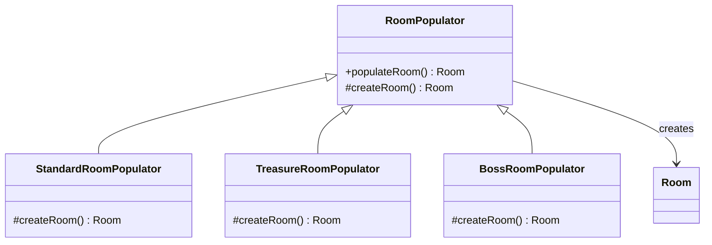
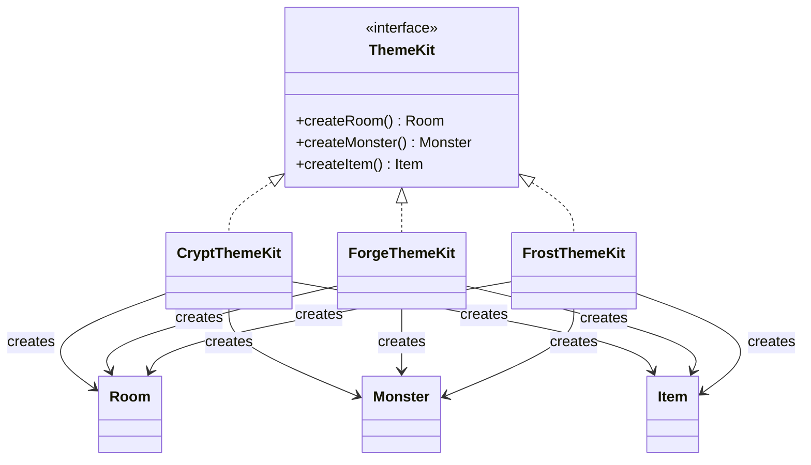

# Factories: Simple Factory, Factory Method, and Abstract Factory

## Video Goal

In this lesson, I introduce three closely related approaches for **separating object creation from the code that uses those objects**:

* The **Simple Factory idiom**
* The **Factory Method pattern**
* The **Abstract Factory pattern**

The goal is to understand:

* Why object creation can become a design problem
* How factories separate **creation from use**
* The difference between the Simple Factory, Factory Method, and Abstract Factory
* When each approach is appropriate
* How these approaches support good OOP design
* How the patterns apply to DungeonForge

> **Key idea:**
> **Factories let us ask for an object without requiring the code that uses it to know exactly how that object is created.**

---

# 1. The Problem: Creating Objects

Suppose DungeonForge needs to create different types of monsters.

Without a factory, some other class might need to know:

```java
if (type.equals("goblin")) {
    return new Goblin();
} else if (type.equals("troll")) {
    return new Troll();
} else if (type.equals("dragon")) {
    return new Dragon();
}
```

Now the code that **uses monsters** also knows about all the **concrete monster classes**.

As the game grows, object creation logic can become scattered throughout the application.

Factories move that responsibility somewhere more appropriate:

```text
Game Code
    │
    │ "Give me a Monster"
    ▼
MonsterFactory
    │
    ├── Goblin
    ├── Troll
    └── Dragon
```

The client cares about the **type it needs**, rather than the details of constructing it.

---

# 2. The Common Idea Behind All Three

All three approaches address the same general design problem:

> **Separate object creation from object use.**

The difference is **how much flexibility and structure we need around creation**.

```text
Simple Factory
     ↓
Centralizes creation

Factory Method
     ↓
Lets subclasses decide what to create

Abstract Factory
     ↓
Creates families of related objects
```

This progression is important:

```text
Simple Factory
      │
      │ more flexibility
      ▼
Factory Method
      │
      │ create related families
      ▼
Abstract Factory
```

---

# 3. Simple Factory Idiom

A **Simple Factory** is not technically one of the original Gang of Four design patterns.

It is better described as a **factory idiom** or common design technique.

The idea is straightforward:

> **Put object-creation logic into a dedicated factory class or method.**

For DungeonForge:

```text id="2qg3js"
┌──────────────┐
│ Game Code    │
└──────┬───────┘
       │
       │ createMonster(...)
       ▼
┌─────────────────┐
│ MonsterFactory  │
└────────┬────────┘
         │
    ┌────┼────┐
    ▼    ▼    ▼
 Goblin Troll Dragon
```

The client doesn't need to directly construct the concrete monster.

---

# 4. Simple Factory Example

Conceptually:

```java
Monster monster = MonsterFactory.create("goblin");
```

The factory contains the creation logic:

```java
public static Monster create(String type) {
    return switch (type) {
        case "goblin" -> new Goblin();
        case "troll"  -> new Troll();
        case "dragon" -> new Dragon();
        default -> throw new IllegalArgumentException();
    };
}
```

The important separation is:

```text
Client
  ↓
asks for Monster
  ↓
Factory
  ↓
decides which concrete class to instantiate
```

This is exactly what DungeonForge's **`MonsterFactory`** is doing.

---

# 5. When to Use a Simple Factory

A Simple Factory is appropriate when:

* There is one central place where objects should be created.
* The number of product types is relatively manageable.
* Creation logic is straightforward.
* You want clients to avoid depending directly on concrete classes.

It is often a good **first step** toward better object-creation design.

However, the factory itself may eventually become a large conditional statement.

That leads us to Factory Method.

---

# 6. Factory Method Pattern

The **Factory Method** pattern moves the creation decision into subclasses.

Instead of one factory containing every creation decision:

```text
Factory
 ├── create A
 ├── create B
 └── create C
```

we have:

```text
Creator
   │
   └── factoryMethod()
          ▲
          │
     ┌────┴────┐
     │         │
Concrete    Concrete
Creator A   Creator B
     │         │
     ▼         ▼
 Product A   Product B
```

The base class defines the **factory method**, but subclasses determine which concrete product gets created.

---

# 7. Factory Method UML

DungeonForge's `RoomPopulator` provides a useful example:



The important point is that `RoomPopulator` can define the overall algorithm for populating a room while allowing subclasses to determine **which kind of room gets created**.

---

# 8. The Factory Method Idea

Think of it as:

> **"I know that I need to create a product, but I'll let my subclass decide which concrete product."**

Conceptually:

```text
RoomPopulator
      │
      │ populateRoom()
      │
      └── calls createRoom()
                    │
          ┌─────────┼─────────┐
          ▼         ▼         ▼
      Standard   Treasure    Boss
       Room        Room       Room
```

This allows the creation decision to vary without changing the base algorithm.

---

# 9. When to Use Factory Method

Factory Method is useful when:

* A base class has a general algorithm or workflow.
* That workflow requires creating an object.
* Different subclasses need different versions of that object.
* You want subclasses to control the concrete product being created.

The important relationship is:

> **The base class controls the process; the subclass controls the product.**

This is exactly the role of DungeonForge's:

```text
RoomPopulator
    ↓
StandardRoomPopulator
TreasureRoomPopulator
BossRoomPopulator
```

---

# 10. Abstract Factory Pattern

The **Abstract Factory** pattern addresses a different problem.

Instead of creating **one type of product**, we need to create a **family of related products** that should work together.

For example, imagine DungeonForge has different dungeon themes.

A theme might need:

```text
Theme
 ├── Room
 ├── Monster
 ├── Item
 └── Decoration
```

A Crypt theme should produce a consistent family:

```text
Crypt Room
Crypt Monster
Crypt Item
Crypt Decoration
```

A Frost theme should produce another consistent family:

```text
Frost Room
Frost Monster
Frost Item
Frost Decoration
```

The Abstract Factory keeps those products consistent.

---

# 11. Abstract Factory UML

DungeonForge's `ThemeKit` is a good example:



The important feature is that each concrete factory creates a **consistent family of products**.

---

# 12. Abstract Factory Mental Model

Think of an Abstract Factory as a **kit of related factories**.

```text
                 ThemeKit
                    │
        ┌───────────┼───────────┐
        ▼           ▼           ▼
      Room       Monster       Item
        │           │           │
        └───────────┴───────────┘
                    │
              one consistent
                   theme
```

Then:

```text
CryptThemeKit
     ↓
Crypt Room
Crypt Monster
Crypt Item
```

while:

```text
FrostThemeKit
     ↓
Frost Room
Frost Monster
Frost Item
```

The client can work with the abstract product types without knowing which concrete theme is being used.

---

# 13. When to Use Abstract Factory

Use Abstract Factory when:

* You need to create **multiple related types of objects**.
* Those objects need to work together.
* You want to switch between entire families of products.
* Client code should not depend on the concrete product classes.

The key phrase is:

> **A family of related objects.**

If you only need to create one kind of object, Abstract Factory is probably unnecessary complexity.

---

# 14. Comparing the Three

The easiest way to distinguish them is by asking:

### Simple Factory

> **"Where should I put my object-creation logic?"**

```text
One factory
     ↓
different products
```

### Factory Method

> **"Which subclass should decide what gets created?"**

```text
Base Creator
     ↓
subclass decides product
```

### Abstract Factory

> **"How do I create a consistent family of related objects?"**

```text
Abstract Factory
     ↓
multiple related products
```

A useful comparison:

| Approach             | Main Idea                        | DungeonForge     |
| -------------------- | -------------------------------- | ---------------- |
| **Simple Factory**   | Centralize creation              | `MonsterFactory` |
| **Factory Method**   | Subclasses determine the product | `RoomPopulator`  |
| **Abstract Factory** | Create related product families  | `ThemeKit`       |

---

# 15. How They Relate to OOP

These approaches support several important OOP principles.

### Encapsulation

Object creation is encapsulated rather than scattered throughout client code.

```text
Client
  ↓
Factory
  ↓
Object creation
```

The client doesn't need to know the construction details.

### Abstraction

Clients generally work with abstract types:

```java
Monster
Room
Item
```

rather than concrete implementations:

```java
Goblin
BossRoom
MagicItem
```

### Polymorphism

Different concrete products can be used through a common interface or superclass.

```text
        Monster
        /     \
   Goblin    Troll
```

The client can work with `Monster` without caring which concrete monster it received.

### Dependency Inversion

Factories can help high-level code depend on **abstractions rather than concrete classes**.

Instead of:

```text
Game → Goblin
```

we can have:

```text
Game → Monster
          ▲
          │
       Factory
          │
        Goblin
```

This reduces direct coupling between client code and concrete implementations.

---

# 16. Factories and Open/Closed Principle

Factories can also support the **Open/Closed Principle**:

> **Software should be open for extension but closed for modification.**

The exact degree depends on the implementation.

A Simple Factory containing:

```java
switch (type) {
    ...
}
```

usually requires modifying the factory when a new product is added.

Factory Method can reduce this problem because a new subclass can provide a new product.

Abstract Factory provides another form of extensibility by allowing an entirely new family of products to be represented by a new concrete factory.

However:

> **Factories don't magically guarantee the Open/Closed Principle.**

The design and implementation still matter.

---

# 17. The Cost of Factories

Factories are useful, but they introduce additional classes and abstractions.

Instead of:

```java
new Goblin();
```

we might now have:

```java
factory.createMonster();
```

That abstraction is valuable when creation is complicated or needs to vary.

But if object construction is trivial and never varies, introducing a factory can simply make the code harder to understand.

This leads to an important principle:

> **Don't introduce a factory just because factories are a design pattern. Introduce one when separating creation provides a real design benefit.**

---

# 18. Common Factory Criticisms

### Simple Factory can become a giant `switch`

As the number of product types grows, the factory can become difficult to maintain.

```text
MonsterFactory
 ├── Goblin
 ├── Troll
 ├── Dragon
 ├── Vampire
 ├── Skeleton
 ├── ...
 └── 50 more cases
```

Factory Method or another approach may eventually be more appropriate.

### Too many abstractions

A simple problem does not necessarily need:

```text
Factory
AbstractFactory
Creator
ConcreteCreator
Product
ConcreteProduct
```

Patterns should solve design problems, not create ceremony.

### Factories can hide complexity

Factories simplify the client, but the complexity has not disappeared.

It has simply been moved into the factory.

That is often exactly what we want, but we should understand the tradeoff.

---

# 19. A Useful Progression

Think of the three approaches as increasing levels of structure.

```text
        Simple Factory
              │
       "One place creates
          the objects."
              │
              ▼
        Factory Method
              │
       "Subclasses decide
       what gets created."
              │
              ▼
       Abstract Factory
              │
       "Create consistent
       families of objects."
```

Don't choose the most complicated pattern automatically.

Choose the **simplest design that solves the problem**.

---

# 20. Final Takeaway

All three approaches are about **object creation**, but they solve progressively different problems.

```text
Simple Factory
    ↓
Centralize object creation

Factory Method
    ↓
Delegate creation to subclasses

Abstract Factory
    ↓
Create families of related objects
```

They support good OOP by helping us:

* Encapsulate object creation
* Program against abstractions
* Reduce coupling to concrete classes
* Use polymorphism
* Separate **what an object does** from **how it gets created**

The most important question is not:

> **"Which factory pattern should I use?"**

Instead ask:

> **"What object-creation problem am I trying to solve?"**

Then choose the simplest approach that addresses it:

```text
One centralized creation point?
        ↓
  Simple Factory

Subclasses need to control creation?
        ↓
  Factory Method

Need families of related objects?
        ↓
  Abstract Factory
```

> **Factories are valuable because object creation is itself a design responsibility. Good OOP doesn't just organize what objects do—it also considers where and how those objects should be created.**
