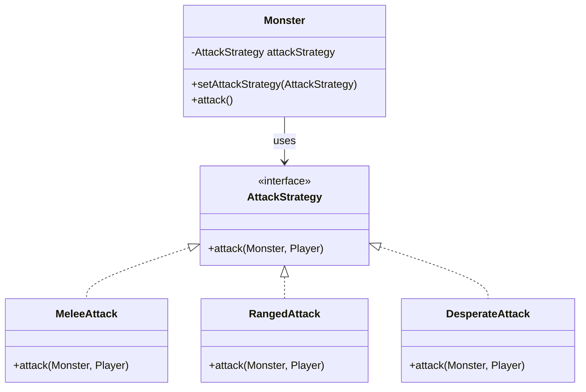
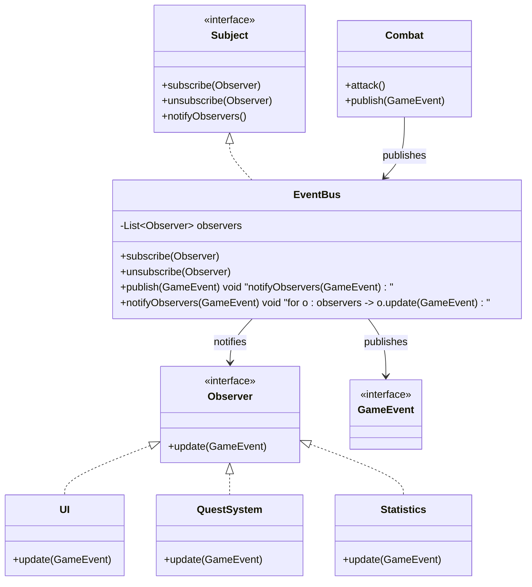

# Strategy and Observer Patterns

## Video Goal

This lesson introduces two behavioral design patterns that help objects work together without becoming tightly coupled:

* **Strategy** — encapsulate interchangeable behaviors so an object can change *how it does something*.
* **Observer** — allow one object to notify other objects when something happens, without knowing who is listening.

By the end, you should understand:

* the problem each pattern solves
* how Strategy and Observer differ
* when each pattern is useful
* how they support good OOP design
* how they appear in DungeonForge

---

# 1. Behavioral Design Patterns

So far, we have seen patterns concerned with **creating objects**:

* Simple Factory
* Factory Method
* Abstract Factory
* Singleton

**Behavioral patterns** focus on something different:

> **How objects behave and communicate with one another.**

Strategy and Observer both change how responsibilities are organized, but they solve very different problems.

| Pattern  | Main Question                                           |
| -------- | ------------------------------------------------------- |
| Strategy | **How can I change an object's behavior?**              |
| Observer | **How can objects be notified when something happens?** |

---

# 2. The Problem: Behavior Can Become Complicated

Imagine a `Monster` that can attack in several different ways.

Without a design pattern, the class might contain a large conditional:

```text
if monster is healthy:
    use normal attack
else if monster is injured:
    use desperate attack
else if player is nearby:
    use melee attack
else:
    use ranged attack
```

As the number of behaviors grows, the `Monster` class becomes responsible for understanding all of them.

This creates a problem:

> **The object that performs a behavior should not necessarily have to contain all of the code that defines that behavior.**

This is where **Strategy** helps.

---

# 3. Strategy Pattern

The **Strategy pattern** encapsulates a family of interchangeable algorithms or behaviors behind a common interface.

Instead of putting every behavior inside `Monster`, we create separate strategy objects.

The `Monster` can then use whichever strategy is appropriate.

### The basic idea

> **Encapsulate a behavior so it can be changed independently from the object that uses it.**

For example:

* `MeleeAttack`
* `RangedAttack`
* `DesperateAttack`
* `SpecialAttack`

could all implement:

```text
AttackStrategy
```

The `Monster` doesn't need to know how each attack works.

---

# 4. Strategy UML



The important relationship is:

```text
Monster
   |
   v
AttackStrategy
   |
   +-- MeleeAttack
   +-- RangedAttack
   +-- DesperateAttack
```

`Monster` knows **what interface to use**, but does not need to know which concrete strategy is currently being used.

---

# 5. Strategy in Action

The `Monster` delegates its attack behavior to its current strategy:

```text
monster.attack()
        |
        v
attackStrategy.attack(...)
```

The strategy can then be changed:

```text
monster.setAttackStrategy(new MeleeAttack())
```

Later:

```text
monster.setAttackStrategy(new DesperateAttack())
```

The `Monster` itself does not need to change.

This is the key benefit of Strategy:

> **The object stays the same while its behavior changes.**

---

# 6. Strategy in DungeonForge

DungeonForge uses this idea for `Monster` attacks.

A monster can select an attack strategy based on things such as:

* its current health
* the room it is in
* the current combat situation
* other game conditions

For example:

```text
Healthy Monster
       |
       v
   MeleeAttack

Low Health
       |
       v
 DesperateAttack

Special Room
       |
       v
 SpecialAttack
```

The important design decision is that the `Monster` does not need to contain all of the attack algorithms.

Instead:

> **Monster decides which behavior to use; the Strategy object defines how that behavior works.**

This keeps the monster's overall responsibility smaller and makes individual attack behaviors easier to change and test.

---

# 7. When Should You Use Strategy?

Strategy is useful when:

* an object has multiple ways of performing an operation
* those behaviors are interchangeable
* conditional logic is becoming complicated
* behaviors need to change at runtime
* you want to add new behaviors without modifying the main class
* individual behaviors should be independently testable

A useful warning sign is:

> **"This class has a large `if`/`switch` deciding which algorithm to run."**

That does not automatically mean Strategy is required, but it is worth considering.

---

# 8. Strategy and Composition

Strategy is strongly associated with **composition**.

Instead of saying:

```text
A Monster IS-A MeleeMonster
```

we can say:

```text
A Monster HAS-A AttackStrategy
```

The monster is composed with a behavior.

This gives us flexibility:

```text
Monster
   |
   +-- has an --> AttackStrategy
```

rather than creating a separate subclass for every possible combination of behavior.

This is one reason Strategy is often described as:

> **"Favor composition over inheritance."**

---

# 9. Strategy and Polymorphism

Strategy also demonstrates polymorphism.

All strategies share the same interface:

```text
AttackStrategy
```

but each implementation behaves differently.

The `Monster` can therefore write code against the abstraction:

```text
AttackStrategy strategy
```

rather than:

```text
MeleeAttack strategy
```

The actual behavior is determined by the concrete object at runtime.

---

# 10. Observer Pattern

Strategy answers:

> **"How can I change behavior?"**

Observer answers:

> **"How can I notify other objects when something happens?"**

The Observer pattern establishes a **one-to-many relationship**:

> When one object changes state or an event occurs, multiple interested objects can be notified automatically.

The object generating the event does not need to know exactly which objects are interested.

---

# 11. The Problem Observer Solves

Imagine combat code directly calling every system that might care about a combat event:

```text
Combat
  |
  +--> update UI
  +--> update QuestSystem
  +--> update AchievementSystem
  +--> update Statistics
  +--> play sound
  +--> write log
```

This creates tight coupling.

`Combat` now has to know about all of those systems.

Adding a new listener means modifying `Combat`.

Observer provides a different approach:

```text
Combat
   |
   v
 EventBus
   |
   +--> UI
   +--> QuestSystem
   +--> AchievementSystem
   +--> Statistics
   +--> Logger
```

`Combat` only needs to publish the event.

---

# 12. Observer UML

A traditional Observer implementation looks like this:



The important idea is that `Combat` does **not** directly depend on `UI`, `QuestSystem`, or `Statistics`.

It depends on the event mechanism.

---

# 13. Observer in DungeonForge

DungeonForge uses an `EventBus` to implement this idea.

For example, Combat can publish:

```text
GameEvent
```

without knowing who cares about it.

Different systems can observe those events:

```text
Combat
   |
   | publishes
   v
GameEvent
   |
   v
EventBus
   |
   +----> UI
   +----> Game system
   +----> Logging
   +----> Other observers
```

A combat class therefore doesn't need code such as:

```text
ui.update(...)
questSystem.update(...)
statistics.update(...)
```

Instead:

```text
eventBus.publish(event)
```

The EventBus handles notifying interested observers.

This creates a much looser relationship between the publisher and the systems that react to events.

---

# 14. Observer: Publisher and Subscribers

A useful way to think about Observer is:

### Publisher

Something happens and an object publishes information about it.

```text
Combat → GameEvent
```

### Subscriber / Observer

Another object says:

> "I am interested in this type of event."

```text
UI → GameEvent
QuestSystem → GameEvent
Statistics → GameEvent
```

When the event occurs:

```text
Publisher
    |
    v
 Event
    |
    v
Subscribers
```

The publisher does not need to know exactly who the subscribers are.

---

# 15. When Should You Use Observer?

Observer is useful when:

* multiple objects need to react to the same event
* the publisher should not know about its listeners
* systems need to be added or removed independently
* changes in one object should trigger reactions elsewhere
* you are building an event-driven system
* direct communication would create too many dependencies

Common examples include:

* GUI events
* game events
* notifications
* logging
* UI updates
* achievement systems
* messaging systems
* event buses

---

# 16. Strategy vs. Observer

These patterns are easy to confuse because both use interfaces and polymorphism.

But they solve different problems.

|                   | Strategy                             | Observer                         |
| ----------------- | ------------------------------------ | -------------------------------- |
| Main purpose      | Change behavior                      | Notify interested objects        |
| Relationship      | Usually one object uses one strategy | One publisher has many observers |
| Focus             | **How something is done**            | **What happened**                |
| Communication     | Delegation                           | Notification                     |
| Typical structure | Object → Strategy                    | Publisher → Observers            |
| DungeonForge      | Monster → AttackStrategy             | EventBus → GameEvent observers   |

A useful mental model:

> **Strategy = "How should I do this?"**

> **Observer = "Who needs to know this happened?"**

---

# 17. OOP Principles

Both patterns reinforce several important OOP principles.

### Encapsulation

Behavior and event-handling responsibilities are placed in their own objects rather than being spread throughout unrelated classes.

### Abstraction

Clients depend on interfaces such as:

```text
AttackStrategy
Observer
```

rather than concrete implementations.

### Polymorphism

Different strategies can be substituted for one another, and different observers can respond to the same event in different ways.

### Composition

Strategy particularly demonstrates composition:

```text
Monster HAS-A AttackStrategy
```

rather than requiring inheritance for every behavior.

### Dependency Inversion

Higher-level objects can depend on abstractions instead of concrete implementations.

For example:

```text
Monster → AttackStrategy
```

rather than:

```text
Monster → MeleeAttack
```

Similarly, publishers should depend on the event abstraction rather than directly depending on every system that responds to the event.

---

# 18. Open/Closed Principle

Both patterns can support the **Open/Closed Principle**:

> Software should be open for extension but closed for modification.

### Strategy

Add a new strategy:

```text
PoisonAttack
```

without changing the existing `Monster` class.

### Observer

Add a new observer:

```text
AchievementSystem
```

without changing the code that publishes the event.

This is a major advantage of both patterns.

However:

> **Using a design pattern does not automatically make code Open/Closed.**

The surrounding design still matters.

---

# 19. Strategy Criticisms

Strategy has costs.

### More classes

Instead of one class containing several behaviors, you may have:

```text
AttackStrategy
MeleeAttack
RangedAttack
DesperateAttack
...
```

For a very simple behavior, that can be unnecessary ceremony.

### Too many tiny classes

If every small variation becomes a Strategy, the design can become difficult for beginners to navigate.

### Choosing strategies still requires logic

Something still has to decide:

```text
Which strategy should I use?
```

Strategy moves the behavior out of the main class; it does not magically eliminate the decision.

---

# 20. Observer Criticisms

Observer also introduces tradeoffs.

### Indirect control flow

A call such as:

```text
eventBus.publish(event)
```

can cause many things to happen elsewhere.

This can make the program harder to follow.

### Hidden dependencies

A class may appear simple because it only publishes an event, while many other systems react to that event.

### Event ordering

If multiple observers react to an event, the order in which they execute can become important.

### Event overload

An EventBus can become a dumping ground for unrelated events.

A good event system should have clear event definitions and ownership rather than becoming:

> "Send everything through the EventBus."

---

# 21. Observer and Memory/Lifecycle Issues

Observers also introduce an important practical concern:

> **Who is subscribed, and when are they unsubscribed?**

If an object subscribes to an event system and never unsubscribes when it should, the EventBus may continue holding a reference to it.

This can cause:

* stale observers
* unexpected notifications
* memory leaks in some environments
* difficult-to-understand program behavior

Lifecycle management is therefore an important part of a real Observer implementation.

---

# 22. The Two Patterns Together

Strategy and Observer can also work together.

For example:

```text
Monster
   |
   | selects
   v
AttackStrategy
   |
   | performs attack
   v
GameEvent
   |
   v
EventBus
   |
   +----> UI
   +----> QuestSystem
   +----> Statistics
```

The **Strategy** determines *how the monster attacks*.

The **Observer/EventBus** allows the rest of the game to react to *what happened*.

They solve different problems and can therefore complement one another.

---

# 23. A Useful Progression

Think of the patterns this way:

### Strategy

**Separate interchangeable behaviors.**

```text
Monster → AttackStrategy
```

### Observer

**Separate an event from the objects that react to it.**

```text
EventBus → Observers
```

Together:

> **Strategy separates behavior. Observer separates communication.**

---

# 24. DungeonForge Examples

The patterns have clear responsibilities in DungeonForge:

| Pattern  | DungeonForge Example               | Responsibility                              |
| -------- | ---------------------------------- | ------------------------------------------- |
| Strategy | `Monster` + attack strategies      | Encapsulate interchangeable attack behavior |
| Observer | `EventBus` + `GameEvent` observers | Notify systems when game events occur       |

The important design distinction is:

```text
Monster
  |
  +-- Strategy → "How do I attack?"
```

versus:

```text
EventBus
  |
  +-- Observer → "Who cares that something happened?"
```

---

# 25. Final Takeaway

Strategy and Observer are both **behavioral design patterns**, but they address different design problems.

### Strategy

> **Encapsulate interchangeable behavior and allow it to change independently.**

Use it when an object has multiple ways of performing an operation.

### Observer

> **Notify multiple interested objects without tightly coupling the publisher to its listeners.**

Use it when multiple objects need to react to events or changes.

Both patterns encourage:

* encapsulation
* abstraction
* polymorphism
* composition
* reduced coupling
* separation of responsibilities

But both also add complexity.

The goal is not:

> **"Use design patterns whenever possible."**

The goal is:

> **"Use a pattern when it makes the design easier to change, understand, test, or extend."**

For DungeonForge:

```text
Strategy
    ↓
Changes HOW a monster behaves

Observer
    ↓
Communicates WHAT happened to interested systems
```

That distinction is the key to understanding both patterns.
