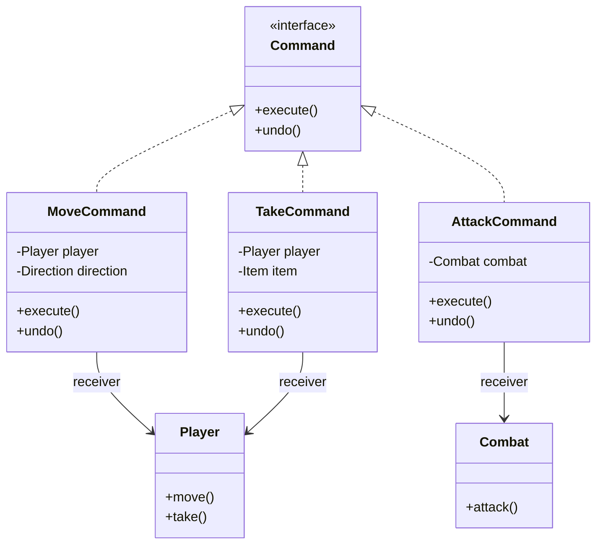
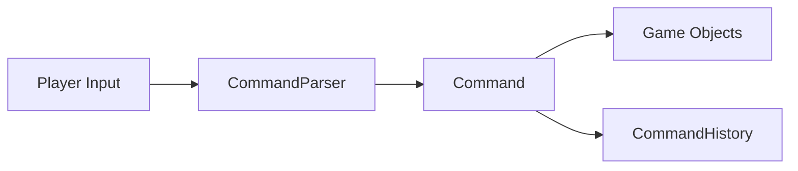

# Command Pattern

## Video Goal

The **Command pattern** turns an action or request into an object.

Instead of writing code that directly performs every action:

```text
if the player typed "move" → move
if the player typed "take" → take
if the player typed "attack" → attack
```

we create objects that represent those actions:

```text
MoveCommand
TakeCommand
AttackCommand
```

The program can then treat an action like any other object: store it, pass it around, execute it, undo it, replay it, combine it with other commands, or test it independently.

> **Key idea:** Command encapsulates a **request** as an object.

DungeonForge uses this idea so that every player action becomes an object that can be remembered and potentially undone.

---

## The Problem: Actions Are Often Buried in Control Flow

A simple game loop might contain a large `if/else` or `switch` statement:

```java
if (input.equals("move")) {
    player.move();
} else if (input.equals("take")) {
    player.take();
} else if (input.equals("attack")) {
    player.attack();
}
```

This works, but the code that **interprets the request** is tightly connected to the code that **performs the action**.

It also makes additional features difficult.

What if we want to:

* undo an action?
* keep a history of actions?
* replay a session?
* create a macro containing several actions?
* queue actions for later?
* test an action independently?
* trigger an action from something other than the keyboard?

The Command pattern separates these responsibilities.

---

# The Core Idea

A Command object represents an action.

```text
        request
           ↓
     +-----------+
     |  Command  |
     +-----------+
           |
        execute()
           |
           ↓
     actual action
```

The caller does not need to know exactly how the action works.

For example:

```java
Command command = new MoveCommand(...);
command.execute();
```

The caller knows:

> "This is something I can execute."

It does not need to know all the details of moving the player.

---

# Basic Command Structure

A typical Command design contains four important roles:

| Role                 | Responsibility                       |
| -------------------- | ------------------------------------ |
| **Command**          | Defines the common command interface |
| **Concrete Command** | Represents a specific action         |
| **Receiver**         | Performs the actual work             |
| **Invoker**          | Requests that the command execute    |

The basic flow is:

```text
Invoker
   |
   | execute()
   ↓
Command
   |
   ↓
ConcreteCommand
   |
   | calls
   ↓
Receiver
```

The **Invoker asks for an action**.

The **Command represents the action**.

The **Receiver performs the action**.

---

# Command UML



The important relationship is:

> **Concrete Commands know how to ask a Receiver to perform an operation.**

---

# What Does the Command Pattern Encapsulate?

The Command pattern encapsulates **a request or action**.

That is the most important answer to remember.

For example:

```text
MoveCommand
AttackCommand
TakeCommand
OpenDoorCommand
UseItemCommand
```

Each object contains whatever information is necessary to perform that action.

This means the thing that varies is the **operation being requested**.

Instead of varying control-flow code:

```java
if (...) { ... }
else if (...) { ... }
else if (...) { ... }
```

we vary the Command objects:

```text
MoveCommand
AttackCommand
TakeCommand
```

> **What varies?**
> The action/request being performed.

---

# What Does the Command Pattern Decouple?

Command primarily decouples the **object requesting an action** from the **object performing the action**.

Without Command:

```text
Input → Game Loop → Player/Combat/etc.
```

The game loop needs to know about every action.

With Command:

```text
Input → Command → Receiver
```

The input system only needs to create or obtain the appropriate Command.

The Command knows how to communicate with the Receiver.

This gives us a useful separation:

> **The Invoker doesn't need to know how the action is performed.**

For example, the same `AttackCommand` could potentially be invoked by:

* a keyboard command
* an AI controller
* a macro
* a replay system
* a test

The Command remains the same.

---

# The Invoker

The **Invoker** is the object that asks a Command to execute.

For example:

```java
command.execute();
```

The invoker does not need to understand the details of the command.

In DungeonForge, the game loop can become very small:

```java
Command command = parser.parse(line, ctx);
command.execute();
history.push(command);
```

Those lines do not need to know whether the command represents moving, attacking, taking an item, or another player action.

This is one of the major benefits of the pattern.

---

# The Receiver

The **Receiver** is the object that actually knows how to perform the work.

For example:

```text
MoveCommand
      |
      ↓
    Player
```

The `MoveCommand` represents the request:

> "Move this player north."

The `Player` contains the domain behavior that actually performs the movement.

Command does **not** mean that all the real behavior should be moved into Command classes.

Instead:

> **Command represents the request; the Receiver performs the domain operation.**

This distinction is important.

---

# Command + Undo

One of the most useful consequences of turning an action into an object is that the action can be **remembered**.

If we store:

```text
Command 1
Command 2
Command 3
Command 4
```

we have a history of what the user asked the program to do.

That makes undo possible.

A command can provide:

```java
void execute();
void undo();
```

For example:

```text
MoveCommand
    execute() → move north
    undo()    → move south
```

The command can store whatever information it needs to reverse its operation.

---

# Undo Is More Than "Do the Opposite"

A common beginner mistake is to think:

> `undo()` simply performs the opposite operation.

Sometimes that works.

But real operations can change many pieces of state.

For example, an attack might change:

```text
Player health
Monster health
Inventory
Experience
Combat state
Random state
```

Simply performing the opposite attack may not restore everything correctly.

DungeonForge therefore uses a `TurnSnapshot` to capture the state affected by a turn so that undo can restore the complete state.

The important design lesson is:

> **Undo must restore the state that the command changed, not merely perform a superficially opposite action.**

---

# Command History

Once Commands are objects, they can be stored.

For example:

```text
History
 ├── MoveCommand
 ├── TakeCommand
 ├── AttackCommand
 └── MoveCommand
```

A history can support:

* undo
* replay
* auditing
* debugging
* command logs

DungeonForge's `CommandHistory` uses a bounded undo stack and an unbounded replay log.

This illustrates an important point:

> **The Command pattern makes these features possible because the actions have become data that the program can store and manipulate.**

---

# Macro Commands

A **Macro Command** is a Command composed of other Commands.

For example:

```text
LootCommand
    ├── TakeCommand
    ├── TakeCommand
    └── TakeCommand
```

Instead of executing one operation, the macro executes several commands.

Conceptually:

```java
class MacroCommand implements Command {
    List<Command> commands;

    public void execute() {
        for (Command command : commands)
            command.execute();
    }
}
```

A macro can even contain another macro.

DungeonForge uses `MacroCommand` to represent a multi-action loot operation. Its undo executes the child commands in reverse order.

Why reverse order?

Because if:

```text
A → B → C
```

changes state in that order, undo should generally restore:

```text
C → B → A
```

This is the same principle used by a stack.

---

# When Should You Use Lambdas Instead?

Not every Command needs its own class.

If the operation is extremely small and doesn't need state, history, or specialized behavior, a lambda can sometimes represent the Command.

For example, with:

```java
@FunctionalInterface
interface Command {
    void execute();
}
```

we could write:

```java
Command openDoor = () -> door.open();
```

This is useful when:

* the command is trivial
* it only needs `execute()`
* it does not need its own state
* it does not need meaningful `undo()` behavior
* creating a named class would add unnecessary ceremony

Use a concrete Command class when the command has meaningful **state, identity, undo behavior, or domain-specific behavior**.

> **Lambda:** simple behavior
> **Command class:** meaningful object

If your Command interface requires several operations such as `execute()`, `undo()`, descriptions, or turn behavior, concrete classes will often be clearer.

---

# Command and Parsing

Command is particularly useful when external input must be translated into actions.

For example:

```text
"move north"
      ↓
CommandParser
      ↓
MoveCommand
      ↓
execute()
```

The parser's job is to translate input into an object.

The Command's job is to represent and perform the requested action.

This separation prevents the parser or game loop from becoming a giant collection of action-specific logic.

DungeonForge uses a registry-based `CommandParser` rather than another `if/else` chain for verbs.

---

# Command and Replay

Once commands are stored, the program can potentially replay them:

```text
MoveCommand
AttackCommand
TakeCommand
MoveCommand
```

Replay simply executes the commands again.

This can support:

* debugging
* automated testing
* demonstrations
* recorded sessions
* reproducing a sequence of actions

DungeonForge includes scripted replay through `--script=` as part of the Command implementation.

The important conceptual connection is:

```text
Action → Object → Store → Replay
```

The Command pattern turns behavior into something the program can manipulate.

---

# Command and Queues

Because Commands are objects, they can also be placed into a queue:

```text
Command Queue

[Move] → [Attack] → [Take] → [Move]
```

A system can then execute them later.

This can be useful for:

* scheduled actions
* AI behavior
* background processing
* turn-based systems
* input buffering

The pattern therefore separates:

> **When an action is requested**

from:

> **When the action is actually executed.**

---

# Command and Testing

Commands can also make behavior easier to test.

Instead of testing the entire user interface:

```text
keyboard → parser → game loop → player
```

a test can construct the Command directly:

```java
Command command = new MoveCommand(player, NORTH);
command.execute();
```

The test can then inspect the resulting state.

This makes Commands useful as a boundary between input handling and domain behavior.

---

# OOP Principles

The Command pattern reinforces several important OOP principles.

### Encapsulation

The Command object encapsulates:

* the requested operation
* the receiver
* any parameters
* any state needed for execution or undo

The caller does not need to know those implementation details.

### Abstraction

The caller can work with:

```java
Command
```

instead of knowing every concrete command type.

### Polymorphism

Different Commands can all be treated as:

```java
Command
```

while implementing different behavior:

```text
MoveCommand
AttackCommand
TakeCommand
OpenDoorCommand
```

The invoker can call:

```java
command.execute();
```

without knowing which concrete Command it received.

### Single Responsibility

The pattern can separate responsibilities:

```text
Parser
    interprets input

Command
    represents an action

Receiver
    performs domain behavior

History
    remembers commands
```

Each class has a more focused responsibility.

### Dependency Inversion

Higher-level code can depend on the `Command` abstraction rather than directly depending on every concrete action.

This reduces coupling between the invoker and individual operations.

---

# Command and Open/Closed Design

Command can also help with the **Open/Closed Principle**.

Without Command, adding a new verb might require modifying a large game loop:

```java
if (...)
else if (...)
else if (...)
else if (...)   // new command
```

With Command, a new action can often be introduced as another implementation:

```text
Command
   ├── MoveCommand
   ├── AttackCommand
   ├── TakeCommand
   └── NewCommand
```

The existing invoker can continue working with the `Command` interface.

This does not automatically make a design Open/Closed, but Command provides a structure that can make extending the set of actions easier.

---

# When Should You Use Command?

Command is particularly useful when you need to:

* represent actions as objects
* separate the requester from the receiver
* queue actions
* store action history
* implement undo/redo
* replay actions
* create macros
* log or audit operations
* execute the same action from multiple sources
* test actions independently
* turn complex input handling into polymorphic objects

A good question to ask is:

> **"Would it be useful if this action were something my program could store, pass around, or manipulate?"**

If the answer is yes, Command may be a good fit.

---

# When Should You NOT Use Command?

Command adds structure, but that structure has a cost.

If the operation is trivial:

```java
player.move();
```

creating:

```text
MoveCommand
AbstractCommand
CommandHistory
CommandInvoker
...
```

may be unnecessary.

Avoid Command when:

* actions are extremely simple
* commands never need to be stored or manipulated
* there is no meaningful separation between requester and receiver
* the abstraction adds more complexity than value

> **Do not use Command simply because it is a design pattern.**

Use it when treating operations as objects provides a real benefit.

---

# Criticisms and Tradeoffs

The main criticism of Command is **additional complexity**.

A simple method call:

```java
player.move();
```

can become:

```text
MoveCommand
    ↓
Invoker
    ↓
execute()
    ↓
Player.move()
```

That is more code and more objects.

Other potential problems include:

### Class Explosion

A system with many operations can produce many Command classes.

### Indirection

It may take longer to discover what actually happens because the request passes through several objects.

### Undo Complexity

Undo is not automatically easy.

Commands must know enough about the state they changed to restore it correctly.

### State Management

If a command changes many objects, determining exactly what must be saved for undo can become complicated.

### Overengineering

For simple applications, Command can be unnecessary ceremony.

---

# Command Is About More Than Undo

Undo is one of the most visible uses of Command, but it is not the definition of the pattern.

The core idea is:

> **Represent a request as an object.**

Once that happens, many capabilities become possible:

```text
                 +----------+
                 |  Command |
                 +----------+
                       |
        +--------------+--------------+
        ↓              ↓              ↓
      Store          Undo           Replay
        ↓              ↓              ↓
      Queue          Macro          Test
```

Undo is therefore a **consequence and use case**, not the fundamental purpose of Command.

---

# Command vs. Strategy

Command and Strategy can look similar because both often use interfaces and polymorphism.

The difference is what they represent.

### Strategy

Encapsulates:

> **How something is done.**

Examples:

```text
AttackStrategy
PathfindingStrategy
SortingStrategy
```

### Command

Encapsulates:

> **A request to do something.**

Examples:

```text
AttackCommand
MoveCommand
TakeCommand
```

A useful mental distinction:

```text
Strategy = "How should I do this?"

Command  = "Do this."
```

---

# Command vs. Method Call

A normal method call is usually immediate:

```java
player.move();
```

A Command turns the request into an object:

```java
Command command = new MoveCommand(player);
```

Now the program can:

```text
store it
pass it
queue it
execute it later
undo it
replay it
combine it
test it
```

That is the fundamental value of the pattern.

---

# The DungeonForge Connection

DungeonForge provides a particularly clear example.

The original problem is a large `gameLoop()` containing action-specific `if/else` logic. The lab deliberately measures that problem before replacing it.

The resulting architecture is conceptually:



The important transformation is:

```text
Before:

Player Input
     ↓
Huge Game Loop
     ↓
Specific Game Logic


After:

Player Input
     ↓
CommandParser
     ↓
Command Object
     ↓
Receiver
```

The Command object becomes the unit that represents the player's action.

That enables DungeonForge to build additional capabilities around the same abstraction:

```text
Command
   ├── execute()
   ├── undo()
   ├── history
   ├── replay
   └── macros
```

The lab's Hourglass feature is a particularly useful demonstration: an item can invoke `history.undoLast()` because the player's previous action exists as an object in command history.

---

# A Useful Mental Model

Think of a Command as a **package containing a request**.

```text
+-----------------------------+
|        MoveCommand          |
|-----------------------------|
| Player                      |
| Direction = NORTH           |
| Previous State              |
|-----------------------------|
| execute()                   |
| undo()                      |
+-----------------------------+
```

Instead of saying:

> "Move the player north right now."

the program creates an object representing:

> "Move this player north."

That object can then travel through the system and be executed whenever appropriate.

---

# The Pattern in One Sentence

> **The Command pattern encapsulates a request as an object, decoupling the object that asks for an action from the object that performs it.**

Once the request is an object, the program can do things that are difficult or awkward with ordinary method calls:

**store it → queue it → execute it → undo it → replay it → combine it → test it**

That is the real value of Command.
