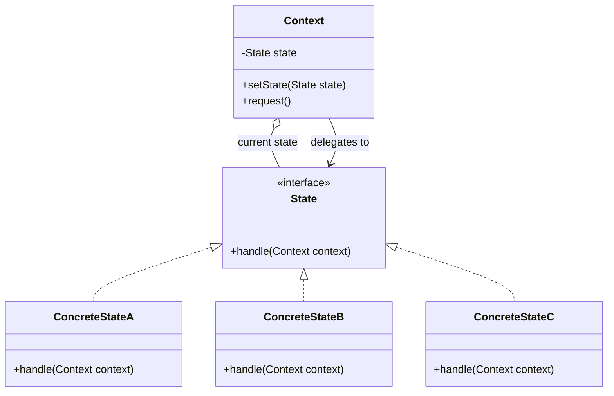
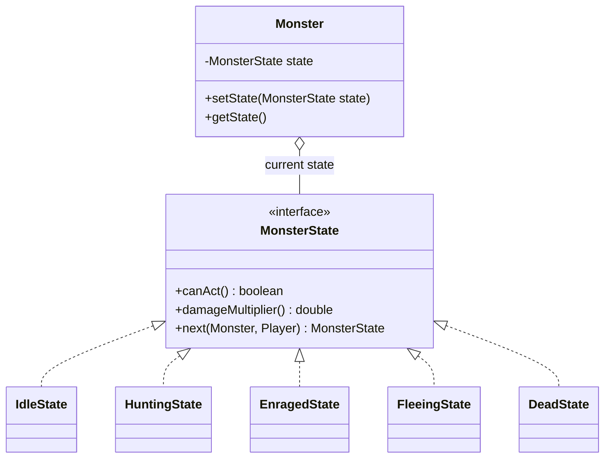
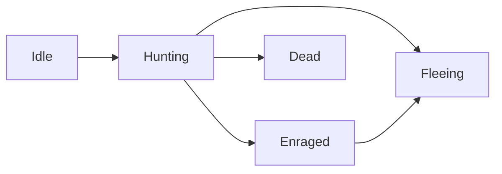
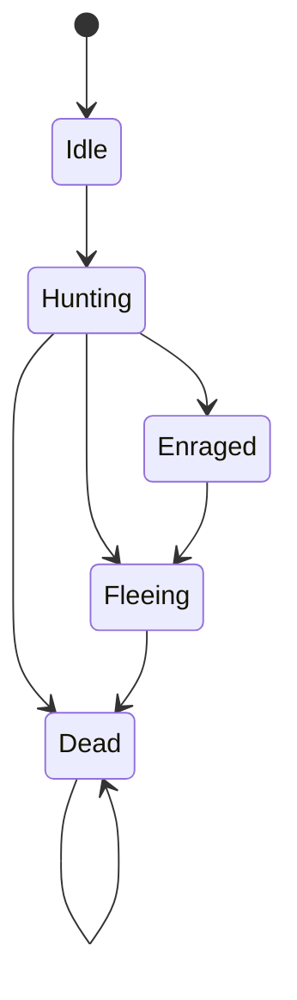
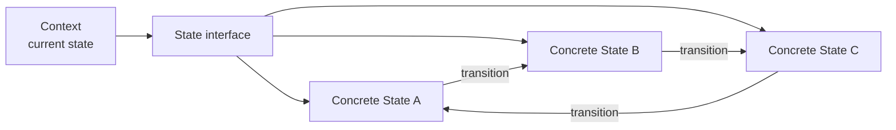

# State Pattern

## Video Goal

The **State pattern** allows an object to change its behavior when its internal state changes.

Instead of putting state-dependent behavior into large `if/else` or `switch` statements, we represent each state as an object.

> **Key idea:** State encapsulates behavior associated with a particular state and lets the object delegate to its current state.

For example, instead of:

```java
if (state.equals("idle")) {
    ...
} else if (state.equals("hunting")) {
    ...
} else if (state.equals("enraged")) {
    ...
} else if (state.equals("fleeing")) {
    ...
}
```

we can have:

```text
IdleState
HuntingState
EnragedState
FleeingState
DeadState
```

The object delegates behavior to whichever state it currently has.

---

# The Problem: State-Dependent Conditionals

Many objects behave differently depending on their current state.

Consider a game character:

```text
Idle
  ↓
Hunting
  ↓
Enraged
  ↓
Fleeing
  ↓
Dead
```

A straightforward implementation might store the state as a `String`, enum, or integer:

```java
private String state;
```

Then every method has to check it:

```java
if (state.equals("idle")) {
    ...
} else if (state.equals("hunting")) {
    ...
} else if (state.equals("enraged")) {
    ...
}
```

As the number of states and behaviors grows, the conditional logic gets spread across the program.

Adding a new state may require modifying many existing methods.

The State pattern moves that state-specific behavior into state objects.

---

# The Core Idea

The State pattern separates:

**What state am I in?**

from:

**What should I do while I am in that state?**

Instead of this:

```text
Object
   |
   +-- state == IDLE?       → behavior
   +-- state == HUNTING?    → behavior
   +-- state == ENRAGED?    → behavior
```

we use:

```text
             Context
                |
                ↓
          Current State
                |
       +--------+--------+
       ↓        ↓        ↓
     Idle    Hunting   Enraged
```

The Context delegates state-dependent behavior to its current State.

---

# State Pattern Structure

The State pattern typically contains two major roles:

| Role               | Responsibility                                      |
| ------------------ | --------------------------------------------------- |
| **Context**        | The object whose behavior changes                   |
| **State**          | Defines behavior associated with a particular state |
| **Concrete State** | Implements behavior for one specific state          |

The Context usually holds a reference to the current State.



The important relationship is:

> **The Context owns the current state and delegates state-dependent behavior to it.**

---

# What Does State Encapsulate?

The State pattern encapsulates **behavior that varies according to the object's current state**.

For example:

```text
IdleState
    canAct() → false

HuntingState
    canAct() → true
    damageMultiplier() → 1.0

EnragedState
    canAct() → true
    damageMultiplier() → 1.5

FleeingState
    canAct() → true
    damageMultiplier() → 0.5
```

Each state contains the rules that apply while the object is in that state.

> **What varies?**
> The behavior associated with the object's current state.

This is why State can replace a collection of state-dependent conditionals.

---

# State Replaces Conditionals

Without State:

```java
if (state == IDLE) {
    ...
} else if (state == HUNTING) {
    ...
} else if (state == ENRAGED) {
    ...
}
```

With State:

```java
state.handle(this);
```

The Context does not need to know which concrete state it currently has.

The polymorphic State object decides what behavior applies.

This is one of the major benefits of the pattern:

> **Instead of asking "What state am I in?" everywhere, the object delegates to the object representing its current state.**

---

# A Concrete Example

Imagine a monster with three behaviors:

```text
Idle
Hunting
Enraged
```

A simple State interface might be:

```java
public interface MonsterState {
    boolean canAct();
    double damageMultiplier();
    MonsterState next(Monster monster, Player player);
}
```

Each state implements those operations differently.



The Monster remains the same object.

Only the object responsible for its current behavior changes.

---

# The Object Does Not Become a Different Object

This is an important conceptual point.

A monster does not become a new monster when it becomes enraged.

It is still the same object:

```text
Monster #42
```

with the same:

* identity
* health
* inventory
* position

But it now delegates state-dependent behavior to:

```text
EnragedState
```

The State pattern therefore gives the impression that the object has changed its class without actually changing its identity.

This is the classic description of the pattern:

> **Allow an object to alter its behavior when its internal state changes. The object will appear to change its class.**

---

# State Transitions

A state machine is not just a collection of states.

The states can have relationships with one another.

For example:

```text
Idle
  ↓
Hunting
  ├──→ Enraged
  ├──→ Fleeing
  └──→ Dead

Enraged
  ↓
Fleeing
```

These relationships are **state transitions**.

This is what makes a State-based design different from simply storing an enum.

The system describes:

> **Which states can follow which other states.**

---

# Who Decides the Next State?

This is one of the most important ideas in the State pattern.

A state can participate in deciding what state comes next.

For example:

```java
MonsterState next(Monster monster, Player player);
```

`HuntingState` might decide:

```text
healthy      → HuntingState
low health   → FleeingState
very angry   → EnragedState
dead         → DeadState
```

Conceptually:



The arrows matter.

> **A State machine is a graph of possible states and transitions.**

---

# Where Should State Changes Happen?

There is no single implementation required by the State pattern.

One approach allows a State to change the Context directly:

```java
context.setState(new EnragedState());
```

Another approach has the State return the next State:

```java
MonsterState next = state.next(monster, player);
monster.setState(next);
```

Both approaches are valid.

The important design question is:

> **Where is the transition decision made, and is that responsibility clear?**

A useful approach is to let the State determine the successor while the Context performs the actual assignment.

That can make transitions easier to test and audit because the transition logic remains visible in the State machine.

---

# State Hooks

States can also have lifecycle hooks.

For example:

```java
default void onEnter(Monster monster) { }
```

and:

```java
default void onExit(Monster monster) { }
```

These allow behavior to occur when a transition happens.

For example:

```text
Hunting
   ↓
Enraged

onEnter()
   ↓
change combat strategy
```

This is useful when entering a state should trigger some additional behavior.

The important distinction is:

> **The State represents the lifecycle; other patterns can represent behavior used within that lifecycle.**

---

# State Can Work With Other Patterns

State does not have to replace every other design pattern.

For example, an object might have both:

```text
Monster
 ├── current State
 └── current Strategy
```

These answer different questions:

```text
State    → WHEN / WHAT MODE am I in?
Strategy → HOW do I perform this behavior?
```

For example:

```text
Monster
   |
   +-- EnragedState
   |
   +-- AggressiveStrategy
```

Entering `EnragedState` could even cause the monster to switch strategies.

This is a useful example of patterns working together rather than competing with one another. In DungeonForge, the State/Strategy relationship is deliberately one-way: a state may change a strategy, while a strategy does not change the state.

---

# State vs. Strategy

State and Strategy are easy to confuse because their UML diagrams can look almost identical.

The difference is **intent and control**.

|                                  | Strategy                       | State                                        |
| -------------------------------- | ------------------------------ | -------------------------------------------- |
| Main question                    | **How?**                       | **When?**                                    |
| Purpose                          | Select an algorithm/behavior   | Represent current condition/mode             |
| Who chooses?                     | Usually the client             | The object/state machine                     |
| Do alternatives know each other? | Usually no                     | Often yes                                    |
| Structure                        | A menu                         | A graph                                      |
| Changes                          | Usually selected intentionally | Changes as the object's lifecycle progresses |

A useful mental model:

```text
Strategy = menu

State = graph
```

A client selects a Strategy.

A State machine moves through connected States.

The strongest code-level distinction is:

> **Strategies generally do not know about each other. States can know about their possible successor states.**

For example:

```text
AggressiveStrategy
       ↓
does not know
about RangedStrategy


HuntingState
       ↓
knows about
EnragedState
FleeingState
DeadState
```

The class diagrams may look alike, but the relationships between the alternatives reveal the difference.

---

# What Does State Decouple?

State decouples the **Context from the details of each state-specific behavior**.

Without State:

```text
Monster
 ├── knows Idle rules
 ├── knows Hunting rules
 ├── knows Enraged rules
 ├── knows Fleeing rules
 └── knows Dead rules
```

With State:

```text
Monster
    |
    ↓
MonsterState
    |
    +── IdleState
    +── HuntingState
    +── EnragedState
    +── FleeingState
    +── DeadState
```

The Context only needs to know about the State abstraction.

It does not need a giant conditional containing every state's implementation.

---

# State and Polymorphism

State is an excellent example of **polymorphism replacing conditional logic**.

Without polymorphism:

```java
switch (state) {
    case IDLE:
        ...
    case HUNTING:
        ...
    case ENRAGED:
        ...
}
```

With polymorphism:

```java
state.handle(context);
```

The same method call produces different behavior depending on the concrete State object.

```text
State
  |
  +-- IdleState      → idle behavior
  +-- HuntingState   → hunting behavior
  +-- EnragedState   → enraged behavior
```

The caller uses the same interface.

The concrete object determines the behavior.

---

# Adding a New State

One of the strongest reasons to use State is that adding a new state can become much more localized.

Suppose we add:

```text
StunnedState
```

With a string-based design, we may need to modify multiple existing methods:

```text
Combat.java
Monster.java
other state-dependent methods...
```

With an object-based State design, the new behavior can often be introduced as:

```text
StunnedState.java
```

without changing the existing state-dependent code.

This supports the **Open/Closed Principle**:

> Existing behavior should require less modification when new states are introduced.

The important caveat is that State does not magically guarantee OCP. The surrounding architecture still determines how extensible the design actually is.

DungeonForge explicitly measures this difference: its object-based version adds `StunnedState` as a new file while leaving `Combat.java` and `Monster.java` unchanged.

---

# State and "Make Illegal States Unrepresentable"

State can also make invalid behavior harder to express.

Suppose movement is only legal while exploring.

Instead of every movement command checking:

```java
if (hasLivingMonsters()) {
    // reject movement
}
```

the game can be in:

```text
ExploringState
```

or:

```text
CombatState
```

and each state defines which operations are legal.

The system can therefore move from:

> **"You are allowed to attempt this, but I will reject it."**

toward:

> **"This operation isn't available in this state."**

This reduces the number of places where developers must remember to enforce the same rule.

In DungeonForge, the game state's allowed-verb list becomes the single source of truth for both command parsing and help.

---

# State and Context-Sensitive Behavior

A State can determine what operations make sense **right now**.

For example:

```text
ExploringState
    move
    inspect
    attack
    pack

CombatState
    attack
    defend
    use
    flee

GameOverState
    restart
    quit
```

The same command system can therefore behave differently depending on the current State.

This is more than validation.

The State defines the current **mode of the object**.

---

# When Should You Use State?

State is particularly useful when:

* an object's behavior depends heavily on its current state
* state-dependent logic appears in many methods
* `if/else` or `switch` statements repeatedly check the same state
* states have meaningful transitions
* adding a state requires modifying many existing methods
* different states have substantially different behavior
* the object has a recognizable lifecycle or finite state machine
* different operations are legal in different states

A useful question is:

> **"Am I repeatedly asking what state this object is in before deciding what it should do?"**

If the answer is yes, State may be appropriate.

---

# When Should You NOT Use State?

State introduces additional objects and abstraction.

Do not automatically replace every enum or conditional with State.

A simple state machine may be perfectly appropriate as:

```java
enum DoorState {
    OPEN,
    CLOSED
}
```

especially when behavior is simple and unlikely to grow.

State becomes more attractive when:

```text
states have substantial behavior
        +
states have transitions
        +
many operations depend on state
```

The pattern should solve a design problem, not create one.

---

# Why Not Just Use an Enum?

An enum is often a perfectly reasonable representation of simple state.

The problem is not:

> "Enums are bad."

The problem is:

```java
enum State { IDLE, HUNTING, ENRAGED }
```

combined with:

```java
switch (state) {
    ...
}
```

in many different places.

That simply moves the state representation without eliminating the conditional logic.

A Java enum can also contain methods and behavior, making enum-based state machines a legitimate alternative for some designs.

The object-based State pattern becomes more useful when states need:

* substantial behavior
* transitions
* state-specific data
* independent testing
* lifecycle hooks
* collaboration with other objects

---

# Finite State Machines

The State pattern is closely related to a **finite state machine (FSM)**.

An FSM consists of:

* a finite set of states
* a current state
* transitions between states
* rules determining when transitions occur
* behavior associated with states

For example:



The State pattern provides an OOP way to represent this machine using objects and polymorphism.

> **Finite-state machine = the model**
> **State pattern = an OOP design for implementing state-dependent behavior**

---

# OOP Principles

The State pattern reinforces several important OOP principles.

### Encapsulation

Each State encapsulates behavior associated with that state.

The Context does not need to know the details.

### Abstraction

The Context works with:

```java
State
```

rather than:

```java
IdleState
HuntingState
EnragedState
```

### Polymorphism

Different concrete States respond differently to the same operation:

```java
state.handle(context);
```

The concrete State determines the behavior.

### Single Responsibility

Instead of one Context class containing the behavior for every state, each Concrete State can focus on one state.

### Open/Closed Principle

New states can often be added as new classes rather than modifying every existing conditional.

### Encapsulation of Change

The pattern localizes changes to state-specific behavior.

This is perhaps the most important design principle:

> **Behavior that changes for the same reason should be kept together.**

---

# Criticisms and Tradeoffs

State is powerful, but it is not free.

### More Classes

A simple enum:

```text
IDLE
HUNTING
DEAD
```

can become:

```text
IdleState.java
HuntingState.java
DeadState.java
```

For a tiny state machine, that may be unnecessary.

### More Indirection

Instead of:

```java
if (state == IDLE)
```

you may have:

```java
state.handle(this);
```

and then have to find the concrete State class to understand the behavior.

### State Explosion

A complicated system can accumulate many states and transitions.

Eventually:

```text
A → B → C → D
 ↘     ↙
   E → F
```

can become difficult to reason about.

Large state machines may require more sophisticated techniques such as hierarchical states or statecharts.

### Transition Complexity

If every state can transition to many other states, the relationships between states can become tightly coupled.

### Hidden State Changes

If states are allowed to change the Context in many different places, it can become difficult to determine where transitions occur.

Good State designs make transitions clear and intentional.

---

# State Transition Design Matters

A State pattern is not automatically well-designed simply because the conditionals disappeared.

Consider:

```text
Who is allowed to change state?
Where does that happen?
Can every state transition to every other state?
Can transitions happen unexpectedly?
Can a state change another part of the object's behavior?
```

These are design questions.

A particularly useful design is one where the state machine's transitions are visible:

```text
Idle
 ↓
Hunting
 ├──→ Enraged
 ├──→ Fleeing
 └──→ Dead
```

The graph becomes part of the design rather than being hidden throughout the code.

---

# A State Machine Is a Graph

This is an important distinction from Strategy.

```text
Strategy:

        Aggressive
             ↑
             |
Client → selects
             |
        Healer
```

The strategies are alternatives.

They generally do not know about one another.

State:

```text
Idle
  ↓
Hunting
  ├──→ Enraged
  ├──→ Fleeing
  └──→ Dead
```

The states form a graph.

The current state participates in determining where the object goes next.

> **Strategy is a menu. State is a graph.**

That distinction is often more useful than memorizing two definitions.

---

# The DungeonForge Connection

DungeonForge uses State at two different levels.

### Monster Lifecycle

```text
Monster
    |
    +── MonsterState
          ├── IdleState
          ├── HuntingState
          ├── EnragedState
          ├── FleeingState
          └── DeadState
```

This replaces a `String` state and state-dependent conditionals in combat.

### Game Modes

```text
GameContext
    |
    +── GameState
          ├── ExploringState
          ├── CombatState
          ├── InventoryState
          └── GameOverState
```

This represents the current mode of the game and the actions that are legal in that mode.

The two applications demonstrate the same pattern solving two different problems:

|                      | Monster Lifecycle           | Game Modes                   |
| -------------------- | --------------------------- | ---------------------------- |
| Context              | `Monster`                   | `GameContext`                |
| State                | `MonsterState`              | `GameState`                  |
| Examples             | idle, hunting, enraged      | exploring, combat, inventory |
| Replaces             | state string + conditionals | duplicated guards + boolean  |
| Transition authority | state transition logic      | game/context conditions      |

These are two applications of the same underlying idea: **move state-specific behavior into polymorphic State objects.**

---

# The Pattern in One Picture



The Context holds the current State.

The State provides the behavior.

Concrete States implement different behavior.

States can participate in transitions.

Polymorphism replaces state-dependent conditionals.

---

# The Pattern in One Sentence

> **The State pattern encapsulates state-specific behavior in separate objects so that a Context can change its behavior by changing its current State rather than relying on large conditional statements.**

Or, even shorter:

> **State encapsulates "what happens when I am in this state."**

---

# The Mental Model to Remember

When you see code like:

```java
if (state == A) {
    ...
} else if (state == B) {
    ...
} else if (state == C) {
    ...
}
```

ask:

> **Are these really different behaviors belonging to different states?**

If they are, State may allow you to replace:

```text
one object
+
many conditionals
```

with:

```text
one Context
+
one State interface
+
multiple Concrete States
```

And if those states have transitions:

```text
A → B → C
```

you are no longer just storing a value.

You are modeling a **state machine**.

That is the real purpose of the State pattern.
